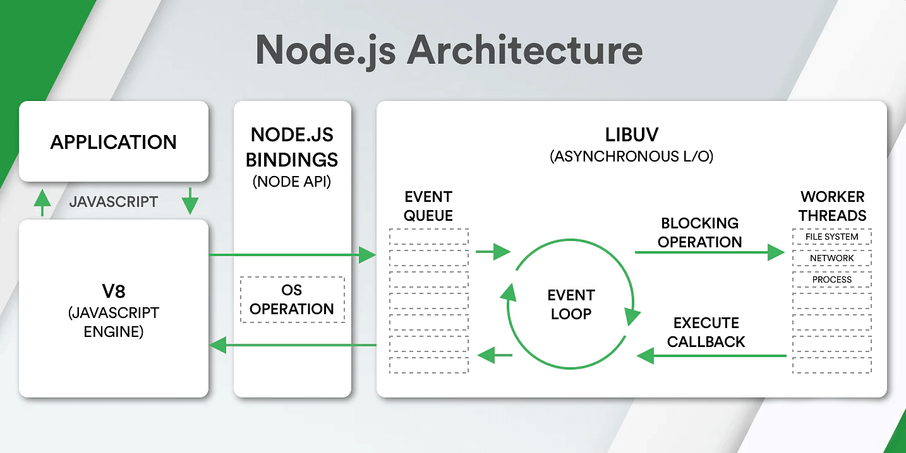

# Via Profit services / Manifest

> Материал для самостоятельного изучения для дожности Fullstack разработчик

## Общие принципы и модули

### TypeScript

[Документация](https://www.typescriptlang.org)

[Playground](https://www.typescriptlang.org/play)

### Регулярные выражения

Документация [здесь](https://developer.mozilla.org/ru/docs/Web/JavaScript/Reference/Global_Objects/RegExp)

Playground [тут](https://regex101.com)

Синтаксис регулярных выражений различается в зависимости от ЯП и реализаци. Но принцип везде один и тот же.

### Event Loop в NodeJS

[Офф. Документация](https://nodejs.org/en/docs/guides/event-loop-timers-and-nexttick)

### GraphQL

[https://graphql.org/graphql-js/](https://graphql.org/graphql-js/ "smartCard-inline")

**Замечание:** Сайт [https://graphql.org/](https://graphql.org/ "‌") содержит общее описание GraphQL.

**Замечание**: На страницах [https://graphql.org/graphql-js/](https://graphql.org/graphql-js/ "‌") содержится, своего рода, справочник по составным частям GraphQL JS. Не стоит воспринимать этот сайт как документацию

Основная спецификация лежит здесь: [https://spec.graphql.org/](https://spec.graphql.org/ "smartCard-inline")

_Примечание: Спецификация под маркером «Working Draft» самая актуальная, но всегда **не полная**_

### Event Emitters

Обязательно изучить что такое и как работает Event Emitter

[Документация](https://nodejs.dev/en/learn/the-nodejs-event-emitter/)

### Date. Работа с датами и времинем

Боль любого разработчика, неважно на каком языке, это работа с датами и времинем.

Дело в том, что дата, наример, какого-либо мероприятия, хранится в базе данных в часовом поясе **UTC+5** _(это Екатеринбург)_, а база данных, сама, работает в часовом поясе **UTC+0**. И всё бы ничего, если бы сервер не работал в часовом поясе, к примеру,**UTC+3** _(это МСК)._ И на этом не всё. Браузер может работать в часовом поясе UTC+10 _(это Хабаровск)_, а пользователь будет вводить дату, как говорят, «по Московскому времени». Если должным образом не обработать дату на каждом этапе, получится ситуация, при которой пользователь будет вводить одну дату, в базу данных долетит другая, а обратно вернётся уже третья дата.

Нужно досконально разбираться с часовыми поясами, читать какие они бывают, какое время существует (GTM и UTC). Как оно маркируется, как преобразуется.

Документация [здесь](https://developer.mozilla.org/en-US/docs/Web/JavaScript/Reference/Global_Objects/Date)

## Frontend

### ReactJS

Без лишних слов: [сюда](https://react.dev/)

### RelayJS

[Документация](https://relay.dv)

RelayJS - это комплес нескольких модулей, которые позволяют максимально грамотно и эффективно использовать GraphQL на фронтенде с React

- [Relay Runtime](https://relay.dev/docs/api-reference/store/ "‌") - Основа Relay, которая представлет собой Store, в котором Relay хранит своё состояние ([https://github.com/facebook/relay/tree/main/packages/relay-runtime](https://github.com/facebook/relay/tree/main/packages/relay-runtime "‌") )
- [Relay Compiler](https://relay.dev/docs/guides/compiler/) - это инструментарий для генерации кода для GraphQL. Он содержит основные функциональные возможности GraphQL codegen, включая синтаксический анализ файлов, проверку подлинности, синтаксический анализ дерева и преобразование. ([https://github.com/facebook/relay/tree/main/packages/relay-compiler](https://github.com/facebook/relay/tree/main/packages/relay-compiler) )
- [React Relay](https://relay.dev/docs/api-reference/use-query-loader/) API между React и Relay ([https://github.com/facebook/relay/tree/main/packages/react-relay](https://github.com/facebook/relay/tree/main/packages/react-relay) )

### React Hook Form

[Документация](https://react-hook-form.com/)

Ни одна форма не обходится без этого инструмента.

Сначала покажется, что это очень сложная неведомая фигня, но потом боль отступит и придёт понимание того, как это устроено.

### Joi Валидация форм

[Документация](https://joi.dev/)

Мы используем эту библиотеку для валидации данных в формах. Только на фронтенде.

### Yup валидация форм

[Документация](https://github.com/jquense/yup)

Мы используем эту библиотеку для валидации данных в формах. Только на фронтенде.

### ‌Styled Components

> Позволяют стилизовать React компоненты не вынося CSS в отдельные файлы

Для стилизации React компонентов используется подход стилизованных компонентов. На этот счёт существует, как минимум, два сторонних модуля. Мы используем, в большинстве проектов, [@emotion](https://emotion.sh)

[Документация](https://emotion.sh/docs/@emotion/react "‌")

[https://emotion.sh/docs/@emotion/react](https://emotion.sh/docs/@emotion/react "smartCard-inline")

[https://emotion.sh/docs/@emotion/styled](https://emotion.sh/docs/@emotion/styled "smartCard-inline")

### React-intl

[Документация](https://formatjs.io/docs/react-intl/components/ "‌")

[FormatJS](https://formatjs.io/ "‌") - библиотека, позволяющая производить манипуляции с интернациональными данными, например, отображать дату в формате YYYY/MM/DD для англоязычных пользователей и DD.MM.YYYY для русскоязычных.

Так же, является [инструментом командной строки](https://formatjs.io/docs/getting-started/installation "‌"), который позволяет генерировать переводы пользовательского интерфейса на различные языки

### Виртуализация списков

[Документация](https://github.com/bvaughn/react-window)

Представим ситуацию, при которой на странице необходимо отобразить одновременно 100 записей в виде списка, где каждый элемент списка содержит большое количество данных (иконки, кнопки и пр.). Всё бы ничего, да вот только:

1. У браузера существует конечный предел на количество нодов на странице
2. Большие списки тормозят интерфейс

Решение - использовть виртуализацию при отрисовке списков. На сегодняшний момент есть несколько библиотек, которые это умеют. Наш выбор пал на [react-window](https://github.com/bvaughn/react-window "‌")

## Backend

### PostgreSQL

[Документация](https://www.postgresql.org/docs/)

Все наши проекты построены на базе данных PostgreSQL

### Redis

В качестве кэшируещего сервера используется Redis

[Документация](https://redis.io/)

На NodeJS используется модуль [ioRedis](https://github.com/redis/ioredis)

### Nginx

GraphQL сервер, сервер web-CRM, файловый сервер и прочие, маршрутизируются при помощи Nginx

[Документация](https://nginx.org/en/docs/)

### Knex

Knex - Это ORM на NodeJS, котрый мы используем для работы с базами данных PostgreSQL

[Документация](https://knexjs.org/)

### Via-profit-services/core

Мы используем собственный сервер GraphQL, разработанный нам под наши задачи.

[Документация](https://github.com/via-profit-services/core/blob/master/docs/introduction.md)

Прошу обратить особое внимание на понимание навигации на курсорах. Сжатый материал описан [здесь](https://github.com/via-profit-services/core/blob/master/docs/connections.md)